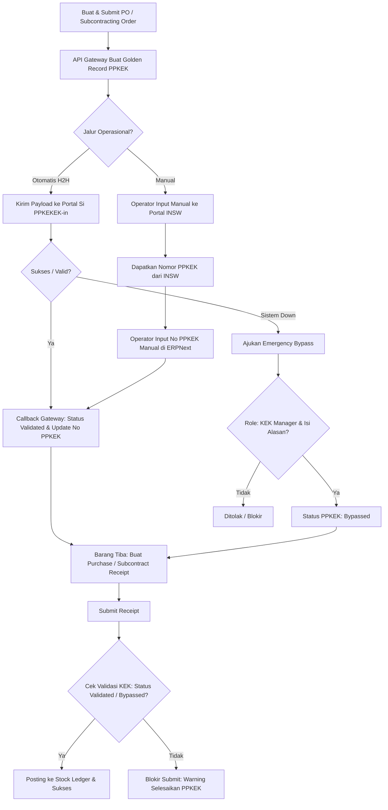
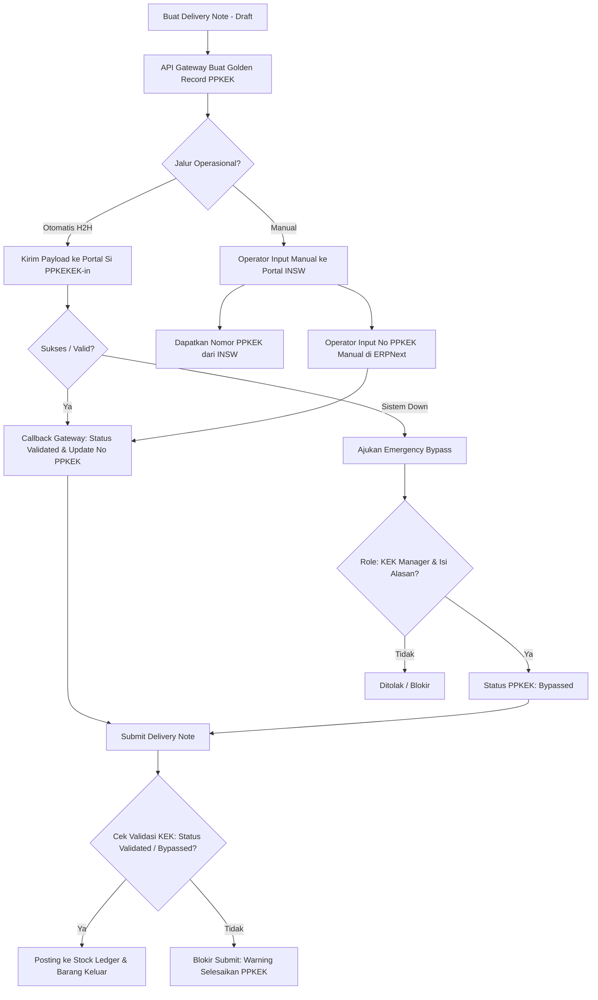

# Bounded Context: KEK IT Inventory Integration & Control (PPKEKI)

## Domain Glossary

### PPKEK
Pemberitahuan Pabean Kawasan Ekonomi Khusus (PJ.01). Dokumen pabean tunggal yang menyatukan seluruh aktivitas pabean masuk-keluar di kawasan KEK.

### PPKEKI
Penyampaian Dokumen PPKEK. Alur dan sistem integrasi penyampaian dokumen PPKEK baik secara manual maupun otomatis (Host-to-Host).

### Dokumen Awal
Dokumen asal di ERPNext yang menjadi pemicu (trigger) pembuatan dokumen PPKEK:
* **Outbound (Pengeluaran):** Menggunakan **Delivery Note** yang sudah di-confirm/submit.
* **Inbound (Pemasukan):** Menggunakan **Purchase Order** atau **Subcontracting Order** (Order Subkontrak) yang telah di-submit. Proses PPKEK diproses terlebih dahulu dari dokumen order ini sebelum barang fisik tiba.

### Dokumen Resmi PPKEK
Dokumen pabean resmi (PJ.01) hasil pembuatan/transmisi yang didasarkan pada Dokumen Awal (Delivery Note, Purchase Order, atau Subcontracting Order) dan divalidasi dengan nomor pendaftaran resmi dari portal INSW / Si PPKEKEK-in.

### Bypassed
Status khusus pada transaksi KEK di mana validasi kepabeanan dilewati secara sengaja karena kondisi darurat (sistem down) menggunakan otorisasi Role `KEK Manager` dengan alasan yang dicatat secara eksplisit.

## Aturan Bisnis & Kontrol Dokumen

### 1. Inbound Enforcement
`Purchase Receipt` atau `Subcontracting Receipt` wajib memuat nomor `PPKEK` yang berstatus `Validated` dari `Purchase Order` atau `Subcontracting Order` asalnya. Jika belum valid, transaksi diblokir saat submit, kecuali jika dilakukan **Emergency Bypass**.

### 2. Emergency Bypass Policy
Saat sistem INSW / Gateway down:
* User dengan Role `KEK Manager` dapat mencentang `Bypass KEK Validation` dengan mengisi `Bypass Reason`.
* Status transaksi diset menjadi `Bypassed`.
### 3. Mismatch Status Triggers
Status `Mismatch` dipicu oleh kondisi-kondisi berikut:
* **Mismatch Ketiadaan (Unpaired):** Dokumen Awal yang tidak memiliki nomor PPKEK terdaftar setelah batas waktu toleransi (> 2 jam).
* **Mismatch Kuantitas / Nilai (Discrepancy):** Terdapat perbedaan kuantitas (Qty), berat bersih (Net Weight), atau nilai transaksi (Amount) antara Dokumen Awal dengan respon pabean PPKEK yang terbit.
* **Mismatch Item:** Item code/HS Code yang tercantum pada Dokumen Awal tidak cocok dengan yang terdaftar di dokumen PPKEK.

## Panduan Arsitektur Non-Intrusif (Zero Core Code Changes)

Untuk menjaga stabilitas ERPNext, seluruh sistem integrasi PPKEKI ini dirancang dengan prinsip **Zero Core Changes**:
1. **Event Hooks:** Menggunakan hook standar ERPNext (`doc_events` pada `hooks.py` custom app) untuk menangkap submit event `Delivery Note` dan `Purchase Invoice`.
2. **Custom Fields & Custom DocTypes:** Semua field kontrol (`bypass_kek_validation`, `kek_status`, `nomor_ppkek`) dan log audit diimplementasikan menggunakan Custom Fields dan Custom DocTypes di dalam modul `kek_it_inventory`, tanpa mengubah schema core ERPNext.
3. **External Gateway Interaction:** Unified API Gateway bertindak sebagai service eksternal atau modul terisolasi di custom app yang berinteraksi dengan API eksternal secara asinkron tanpa memblokir alur database utama ERP.

## Alur Workflow (Visual Diagram)

### 1. Alur Inbound (Pemasukan)

### 2. Alur Outbound (Pengeluaran)

## Panduan UI/UX (Mencegah Kebingungan User)

Agar alur kerja ini intuitif bagi operator gudang dan staf pabean, implementasi UI/UX harus mengikuti ketentuan berikut:

### 1. Indikator Status Visual (Status Banner)
Pada form `Purchase Order`, `Subcontracting Order`, dan `Delivery Note`, tampilkan **Indicator Field** yang mencolok dengan warna yang dinamis sesuai status PPKEK:
*   🟢 **Validated** (Hijau): Menampilkan nomor PPKEK (contoh: `Validated - PPKEK: 12345/PPKEK`).
*   🟡 **Bypassed** (Kuning): Menampilkan alasan bypass (contoh: `Bypassed - Alasan: Portal INSW Down`).
*   🟠 **Pending** (Oranye): Menunjukkan dokumen sedang dalam proses antrean/validasi H2H.
*   🔴 **Mismatch** (Merah): Menunjukkan ada ketidakcocokan data yang memerlukan tindakan perbaikan.

### 2. Pesan Blokir yang Informatif & Solutif (Actionable Error Message)
Ketika operator mencoba melakukan submit `Purchase Receipt` atau `Subcontracting Receipt` namun terblokir, sistem **tidak boleh** memunculkan pesan error teknis yang membingungkan. Pesan harus menunjukkan letak masalah dan solusinya:
> 🚫 **Gagal Submit Penerimaan Barang:**
> Dokumen PPKEK untuk **Purchase Order PO-2026-XXXX** belum divalidasi (Status saat ini: **PENDING**).
> **Solusi:** 
> 1. Harap hubungi staf pabean untuk memproses dokumen PPKEK di Dashboard Monitoring.
> 2. Jika portal INSW sedang gangguan, hubungi **KEK Manager** untuk melakukan *Emergency Bypass*.

### 3. Kendali Akses Kolom Bypass (Role-based Visibility)
*   Kolom checkbox `Bypass KEK Validation` dan text area `Bypass Reason` **disembunyikan atau di-set Read-Only** untuk operator biasa.
*   Kolom tersebut hanya akan aktif (Editable) jika user yang login memiliki Role **`KEK Manager`** atau **`System Manager`**, guna menghindari penyalahgunaan bypass.

